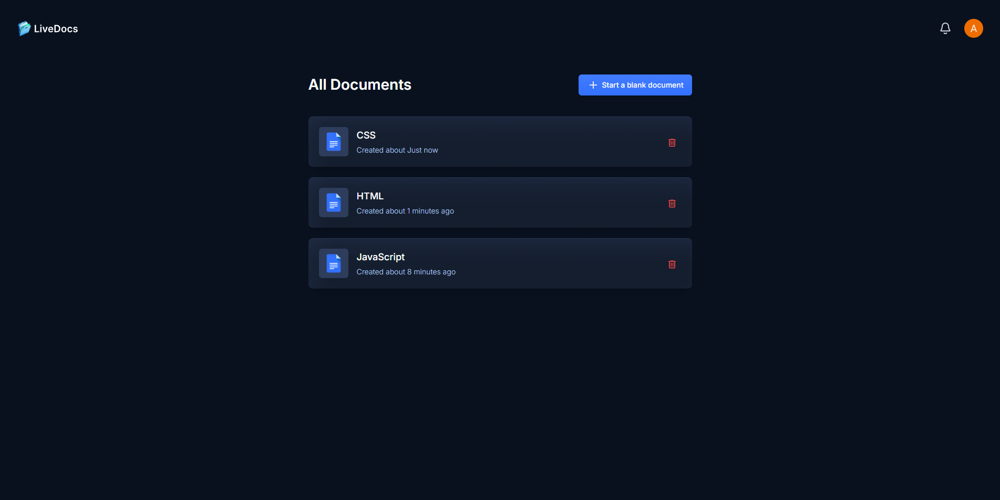
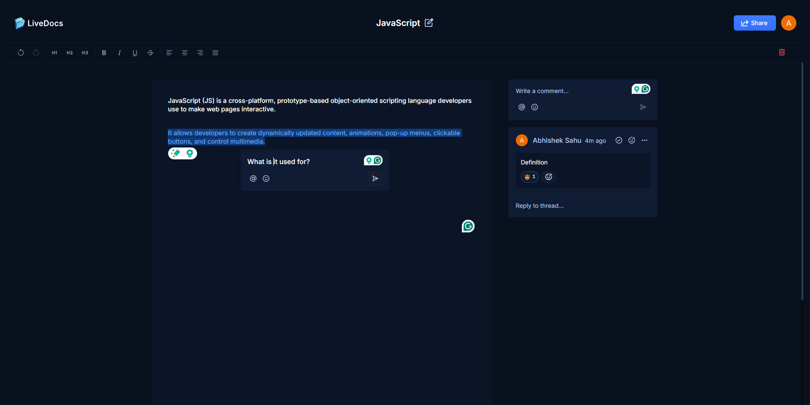

# LiveDocs

It is a real-time collaborating document editing application with other important features. 



[LIVE DEMO](https://livedocuments.vercel.app/)

## Features

- Real-Time Editing: Multiple users can simultaneously edit documents in real-time, with changes appearing instantly for all collaborators.

- Collaborative Commenting: Users can add comments to specific parts of the document, reply to comments, and resolve discussions.

- User Presence Indicators: See who is currently viewing or editing the document with user presence indicators, such as avatars or color-coded cursors.

- Document Permissions: Fine-grained access control, allowing document owners to set different permission levels (view or edit) for collaborators.

- Cross-Device Sync: Seamless synchronization across all devices, ensuring users can continue their work from anywhere.

- Real-Time Notifications: Receive notifications about changes, comments, and mentions within the document.

- Autosave: Automatic saving of changes to prevent data loss and ensure the document is always up to date.

- Account Management: Manage profile name, username, email in profile section, and set password or change password, check active devices, and delete account in security section.



## Tech

- Next.js
- TypeScript
- Clerk 
- Liveblocks
- Lexical Editor
- Tailwind CSS
- Sentry

## Local Run / Production Build

To deploy your Next.js application with TypeScript, follow these steps:

### Prerequisite
- Ensure that you have Node.js is installed.

### 1. Install Dependencies:

- If you haven't already installed your project's dependencies, do so by running:

```bash
  npm install
```
### 2. Run the application locally:

To run this application locally, do this after installing dependencies:

```bash
  npm run dev
```

### 3. Build the Application:

Before deploying, you need to build the production version of your application:

```bash
  npm run build
```

### Thank you


